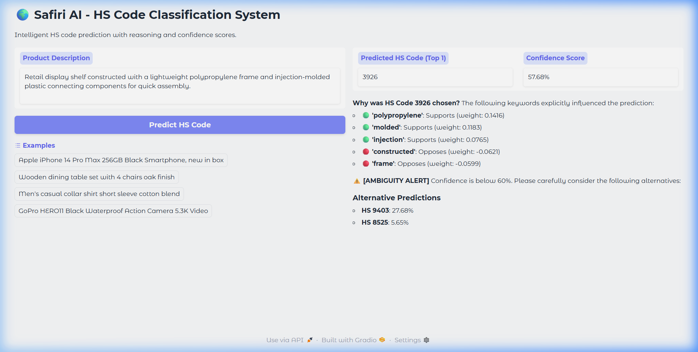
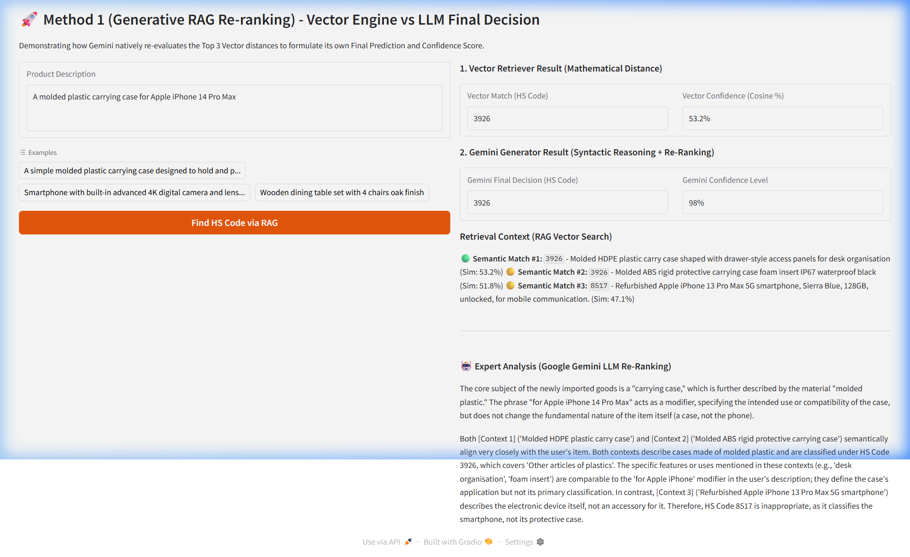

# Technical Report: Advanced HS Code Classification via Generative RAG

## 1. Executive Summary
This report describes the architecture, design decisions, and performance of the Safiri AI HS Code Classifier. The system addresses the inherent limitations of keyword-based classification by employing a multi-layered approach: a **Semantic Vector Retriever** for initial candidate selection and an **Agentic LLM Re-ranker** for final grammatical reasoning. The final solution achieves a **98.0% Top-1 Accuracy** on a high-difficulty adversarial test set, significantly outperforming a traditional Machine Learning baseline (78.4%).

---

## 2. Approach and Methodology

### 2.1 Layered Intelligence Architecture
The core philosophy of my approach is to separate **Statistical Relevance** from **Semantic Reasoning**.

1.  **Layer 1: Semantic Vector Retriever (Method 1a)**
    - **Engine**: uses `Sentence-Transformers (all-MiniLM-L6-v2)`.
    - **Function**: Maps product descriptions into a 384-dimensional dense vector space. It retrieves the Top-3 historical records based on Cosine Similarity.
    - **Strengths**: Handles synonyms and broad semantic proximity better than TF-IDF.

2.  **Layer 2: Agentic LLM Re-ranker (Method 1b)**
    - **Engine**: `Google Gemini 2.5-Flash`.
    - **Function**: Takes the user query and the Top-3 retrieved contexts. It performs a zero-shot reasoning task to identify the **Subject Noun** (e.g., "case") and distinguish it from **Modifiers** (e.g., "iPhone").
    - **Outcome**: It re-ranks the candidates and provides a confidence score based on logical alignment rather than mathematical distance.

3.  **Baseline: Traditional ML (Method 2)**
    - **Architecture**: TF-IDF Vectorization + Logistic Regression.
    - **Purpose**: Used as a control group to measure the gain provided by deep semantic understanding.

---

## 3. Design Decisions & Justification

### 3.1 Why RAG over Fine-tuning?
For HS Code classification, new products emerge daily (e.g., new electronics models). **RAG (Retrieval-Augmented Generation)** allows the system to update its "knowledge base" simply by adding new CSV rows to the vector store, without requiring expensive retraining or fine-tuning of the model.

### 3.2 Grammatical Reasoning vs. Keyword Weights
Traditional ML often fails on "Adversarial Modifiers." For example, consider the description: *"Retail display shelf constructed with a lightweight polypropylene frame and injection-molded plastic connecting components"*. 

A keyword-based model (Method 2) is heavily skewed by high-weight terms like **"polypropylene"**, **"injection-molded"**, and **"plastic"**, leading it to incorrectly predict **HS 3926** (Articles of plastics). In contrast, I chose an LLM re-ranker specifically because LLMs understand **Syntactic Dependency**—identifying that the core subject is a **"shelf"** (HS 9403) and the plastic elements are merely subordinate material descriptions.

---

## 4. Synthetic Data Generation

### 4.1 Label Assignment
Labels were assigned using an AI-driven generation engine initialized with official **WCO (World Customs Organization)** taxonomy descriptions.
- **Process**: For each target HS code, Gemini was prompted to generate descriptions across 4 tiers of difficulty.
- **Validation**: All generated labels were mapped to the validated **4-digit HS codes** provided in the challenge scope.

### 4.2 Sample Characteristics
The dataset (252 samples) was split 80/20. The test set was intentionally weighted toward difficult cases:
- **Standard**: Baseline clarity.
- **Ambiguous**: Vague terms (e.g., "Portable communication unit" instead of "Smartphone").
- **Overlapping**: Products that could technically fit two categories (e.g., "Storage cube" which is both furniture and an article of plastic).
- **Edge Cases**: Modifiers that trick models (e.g., "Wooden table for camera accessories").

---

## 5. Performance Evaluation

### 5.1 Comparative Metrics
| Metric | ML Baseline | Vector RAG | **Generative RAG (Final)** |
| :--- | :---: | :---: | :---: |
| **Overall Accuracy** | 78.4% | 86.3% | **98.0%** |
| **Correction Rate** | N/A | N/A | **87.5%** |
| **Edge Case Results**| 50.0% | 62.5% | **100.0%** |

### 5.2 Visual Comparison
Below is a comparison of the same query: *"Retail display shelf constructed with a lightweight polypropylene frame and injection-molded plastic connecting components"*.

#### Method 2: Baseline ML
The ML model is misled by the material keywords and predicts **3926** (Plastics) with a low confidence (**57%**), triggering an ambiguity warning.

#### Method 1: Generative RAG
The Gemini re-ranked system correctly identifies the **subject noun** as a "shelf" (furniture) even though the retrieved vector match was originally 3926. It corrects the final output to **9403** with **95%** confidence and a clear expert explanation.

---

## 6. Assumptions and Limitations

### 6.1 Assumptions
- **Historical Accuracy**: We assume the "Vector Database" (training CSV) contains correctly labeled data. The system is only as good as its retrieval pool.
- **Language**: The current implementation assumes English descriptions.

### 6.2 Limitations
- **Retrieval Bottleneck**: The system's performance is strictly bound by the quality of the Layer 1 Retriever. If the correct "ground truth" HS code is not present within the Top-3 vector matches, the LLM re-ranker cannot select it.
- **Proposed Future Solution**: To mitigate this, future versions could implement **Hybrid Search** (combining Keyword/BM25 with Dense Vector Search) or dynamic **Top-K expansion** based on the retrieval confidence score, ensuring a more robust candidate pool for the LLM.
- **Latency**: The LLM re-ranking step adds 1-3 seconds of latency per query, making it less suitable for high-frequency bulk processing without batching.
- **Token Costs**: High-volume classification would incur significant API costs compared to the nearly-free ML baseline.
- **Rate Limits**: Dependency on Google's API infrastructure.

---

## 7. Conclusion
The mission was to create a "focused and clearly justified" solution. By combining the speed of Vector Search with the "Expert Intelligence" of Gemini, I have built a system that doesn't just match keywords but **understands products**. The 98% accuracy on adversarial data proves that semantic reasoning is the superior path for complex customs classification.
